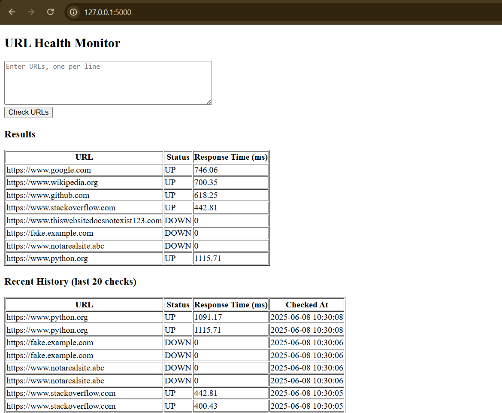

# URL Health Monitor (Flask + SQLite)

A web-based tool to monitor the health of multiple URLs. Built using **Flask** and **SQLite**, this app checks if websites are **UP or DOWN**, tracks **response time**, and stores results in a local database.

---

##  Screenshot



---

## Features

-  Real-time UP/DOWN check for multiple URLs
-  Response time display in milliseconds
-  Stores status history in a local SQLite database (`url_status.db`)
-  Simple web UI using HTML (Jinja2 templating)
-  Dockerized for easy deployment

---

## 📁 Project Structure
```
url_health_monitor/
├── templates/
│ └── index.html # Web UI template (Jinja2)
├── app.py # Main Flask app
├── url_status.db # SQLite database for storing URL check logs
├── Dockerfile # Docker image setup
├── requirements.txt # Project dependencies
└── README.md # Project documentation (you are here)
```


---

## 🧰 Tech Stack

- Python 3.8+
- Flask
- SQLite (via `sqlite3` module)
- HTML/CSS (Jinja2 templating)
- Docker 

---

## Installation

### Run Locally

1. **Clone the repository**
   ```bash
   git clone
   cd url_health_monitor

2. Install dependencies
   ```bash
   pip install -r requirements.txt

3. Run the Flask app
   ```bash
   python app.py

4. Visit http://127.0.0.1:5000 in your browser.


